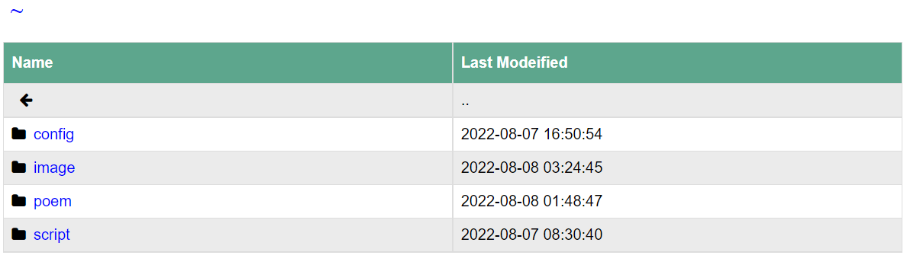
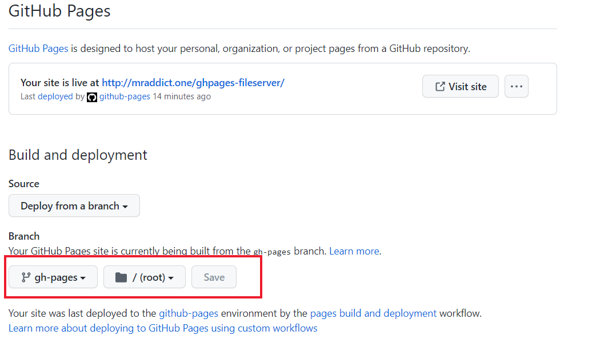

<h1>Github Pages Fileserver👻
</h1>

## 1. Description

A simple file server which runs on github pages.

Remember, this project is only for experiment, do not abuse github pages server. Be aware of that github already have offerred us many free services!

And do not put too big files in your folder, otherwise it will take a long to load!



## 2. How to Use

You should put all your files you want to serve on github pages in `src` folder, then run below command in your project's root path:

```bash
python ghpages-fileserver.py
```

It will generate a `public` folder contains all your fils and some html files. You can directly open these html files in your browser.

> Demo: [https://mraddict.one/ghpages-fileserver](https://mr-addict.github.io/ghpages-fileserver)

## 3. Have a Try

You can fork my repo and it will automatic generate a github pages smililar to this:

```
https://username.github.io/ghpages-fileserver
```

Do not forget to enable github pages on your project after actions build finish:



## 4. Github Pages Usage Limits

Below terms is quoted form [github pages offical site](https://docs.github.com/en/pages/getting-started-with-github-pages/about-github-pages):

> GitHub Pages sites are subject to the following usage limits:
> 
> - GitHub Pages source repositories have a recommended limit of 1 GB.
> - Published GitHub Pages sites may be no larger than 1 GB.
> - GitHub Pages sites have a soft bandwidth limit of 100 GB per month.
> - GitHub Pages sites have a soft limit of 10 builds per hour. This limit does not apply if you build and publish your site with a custom GitHub Actions workflow
> - In order to provide consistent quality of service for all GitHub Pages sites, rate limits may apply. These rate limits are not intended to interfere with legitimate uses of GitHub Pages. If your request triggers rate limiting, you will receive an appropriate response with an HTTP status code of 429, along with an informative HTML body.
> 
> If your site exceeds these usage quotas, we may not be able to serve your site, or you may receive a polite email from GitHub Support suggesting strategies for reducing your site's impact on our servers, including putting a third-party content distribution network (CDN) in front of your site, making use of other GitHub features such as releases, or moving to a different hosting service that might better fit your needs.
