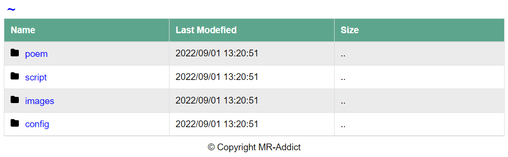

<h1>Github Pages Fileserver👻
</h1>

## 1. Description

A simple file server running on github pages.

Remember, this project is only for experiment, do not abuse github pages server. Github already has offerred us many free services!

And do not put too big files in your folder too, otherwise it will take a long time to load!

## 2. How to Use

### 2.1 Clone repository

You can clone my repo, and put all your files you want to serve in `src` folder.

```
git clone https://github.com/MR-Addict/ghpages-fileserver.git
```

### 2.2 Generate static files

After that run below command in your projects's root path:

```bash
python main.py
```

It will copy all your files and generate some html files into a new `public` folder.

### 2.3 Build web server

Then run below command:

```bash
python -m http.server 8080 --directory public
```

It will create a web server on your local machine, you can now visit it at [http://localhost:8080](http://localhost:8080)



## 3. Have a Try

You can fork my repo and it will automatically generate a github pages smililar to this:

```
https://username.github.io/ghpages-fileserver
```

Do not forget to enable github pages on your project after actions finished building:


> Demo Page: [https://mr-addict.github.io/ghpages-fileserver](https://mr-addict.github.io/ghpages-fileserver)

## 4. Github Pages Usage Limits

Below terms is quoted form [github pages offical site](https://docs.github.com/en/pages/getting-started-with-github-pages/about-github-pages):

> GitHub Pages sites are subject to the following usage limits:
> 
> - GitHub Pages source repositories have a recommended limit of 1 GB.
> - Published GitHub Pages sites may be no larger than 1 GB.
> - GitHub Pages sites have a soft bandwidth limit of 100 GB per month.
> - GitHub Pages sites have a soft limit of 10 builds per hour. This limit does not apply if you build and publish your site with a custom GitHub Actions workflow
> - In order to provide consistent quality of service for all GitHub Pages sites, rate limits may apply. These rate limits are not intended to interfere with legitimate uses of GitHub Pages. If your request triggers rate limiting, you will receive an appropriate response with an HTTP status code of 429, along with an informative HTML body.
> 
> If your site exceeds these usage quotas, we may not be able to serve your site, or you may receive a polite email from GitHub Support suggesting strategies for reducing your site's impact on our servers, including putting a third-party content distribution network (CDN) in front of your site, making use of other GitHub features such as releases, or moving to a different hosting service that might better fit your needs.
